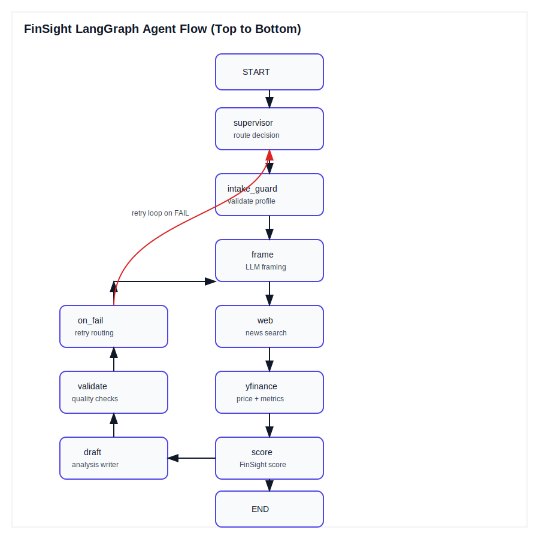

# FinSight

FinSight is a full-stack financial analysis demo that blends live market data, web news signals, and a LangGraph orchestration layer to generate a structured investment-style brief with sources.



## What It Does

- Collects a user profile and generates 12 profile-aligned growth picks (USA + Canada)
- Answers a free-form investment question with price, evidence, bull/bear cases, risks, and last quarter context
- Produces a concise executive summary and an expected return range for the selected horizon
- Computes a FinSight score with a transparent breakdown

## How The Agent Works

The backend uses LangGraph to wire specialized nodes as a reusable reasoning pipeline:

1. **supervisor** chooses the route
2. **intake_guard** validates the profile
3. **frame** builds a task frame
4. **web** gathers news evidence
5. **yfinance** collects price and metrics (with Yahoo fallback)
6. **score** produces a score + breakdown
7. **draft** writes the analysis
8. **validate** checks output quality
9. **on_fail** handles retry loops

The image above mirrors the actual node/edge flow created in the LangGraph setup.

## Tech Stack

**Backend**
- Python 3.12
- FastAPI
- LangGraph
- LangChain
- Groq LLM (via `langchain_groq`)
- yfinance + Yahoo Finance quote fallback
- DuckDuckGo search (ddgs)

**Frontend**
- React (Vite)
- Tailwind CSS

**Other Tools**
- Python Dotenv
- Requests

## Local Setup

1) Create a `.env` in the project root:

```
GROQ_API_KEY=your_key
GROQ_MODEL=llama-3.3-70b-versatile
```

2) Backend

```
python -m venv .venv
.\.venv\Scripts\python.exe -m pip install -r backend\requirements.txt
.\.venv\Scripts\python.exe -m uvicorn main:app --app-dir backend --host 127.0.0.1 --port 8000
```

3) Frontend

```
cd frontend
npm install
npm run dev
```

Open: `http://localhost:5173`

## Project Structure

```
backend/        FastAPI + LangGraph agent
frontend/       React UI
docs/           Diagrams and assets
```

## Notes

- Data and outputs are educational only and not financial advice.
- Real-time pricing depends on market hours and provider response.

Made with <3 by Chinmay Raval from Canada. Contact: ravalchinmay6497@gmail.com
